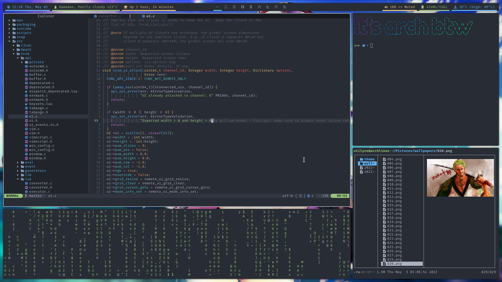

# Dotfiles



## Installation

Clone the repository:

```bash
git clone https://github.com/utilyre/dotfiles.git
cd dotfiles
```

Run the installation script:

```bash
DOTFILES_CACHE="$HOME/.cache/dotfiles" ./install.sh
```
